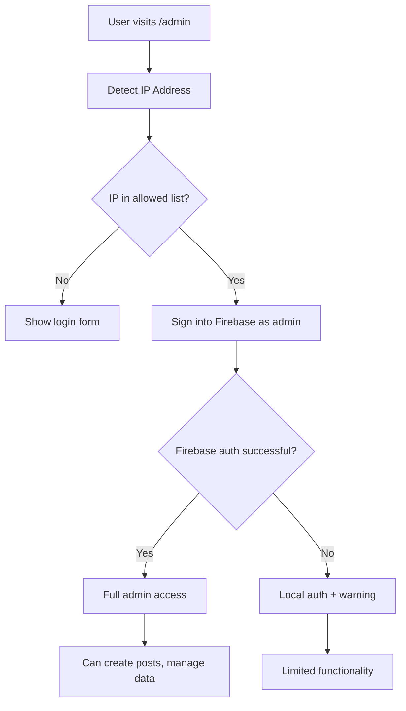

# IP-Based Admin Authentication Setup

This feature allows automatic admin authentication based on the user's IP address, providing seamless access for trusted devices/networks without requiring manual email/password or OTP authentication.

## Configuration

### Environment Variables

Add the following environment variables to your `.env` file:

```env
# Enable or disable IP-based authentication
VITE_IP_AUTH_ENABLED=true

# Comma-separated list of allowed IP addresses for admin access
# Supports exact IPs and CIDR notation
VITE_ADMIN_ALLOWED_IPS=127.0.0.1,::1,192.168.1.0/24

# Admin password for automatic Firebase authentication
# Required for Firestore security rules to recognize IP-authenticated users
VITE_ADMIN_AUTO_PASSWORD=your-secure-admin-password
```

### IP Address Formats

The system supports multiple IP address formats:

1. **Exact IP Match**
   ```
   127.0.0.1
   203.0.113.45
   ```

2. **CIDR Notation** (IP ranges)
   ```
   192.168.1.0/24    # Allows 192.168.1.1 to 192.168.1.254
   10.0.0.0/8        # Allows 10.0.0.1 to 10.255.255.254
   172.16.0.0/12     # Allows 172.16.0.1 to 172.31.255.254
   ```

3. **IPv6 Support**
   ```
   ::1               # IPv6 localhost
   2001:db8::/32     # IPv6 CIDR range
   ```

### Example Configurations

#### Home Office Setup
```env
VITE_IP_AUTH_ENABLED=true
VITE_ADMIN_ALLOWED_IPS=127.0.0.1,::1,192.168.1.0/24
VITE_ADMIN_AUTO_PASSWORD=MySecurePassword123!
```

#### Multiple Locations
```env
VITE_IP_AUTH_ENABLED=true
VITE_ADMIN_ALLOWED_IPS=127.0.0.1,203.0.113.45,198.51.100.0/24,192.168.1.0/24
VITE_ADMIN_AUTO_PASSWORD=MySecurePassword123!
```

#### Development Only
```env
VITE_IP_AUTH_ENABLED=true
VITE_ADMIN_ALLOWED_IPS=127.0.0.1,::1
VITE_ADMIN_AUTO_PASSWORD=DevPassword123!
```

## How It Works

1. **IP Detection**: When accessing the admin login page, the system automatically detects the user's IP address
2. **IP Authorization Check**: Compares the detected IP against the allowed IP list
3. **Firebase Authentication**: If IP is authorized, automatically signs the user into Firebase as admin
4. **Firestore Access**: Firebase authentication ensures Firestore security rules recognize the user as admin
5. **Session Management**: Maintains both Firebase and local authentication state
6. **Fallback Protection**: If Firebase auth fails, provides local-only authentication with warnings

### Authentication Flow



## Security Considerations

### Best Practices

1. **Use Specific IP Ranges**: Avoid overly broad CIDR ranges like `0.0.0.0/0`
2. **Strong Admin Password**: Use a secure password for `VITE_ADMIN_AUTO_PASSWORD`
3. **Regular Review**: Periodically review and update allowed IP addresses
4. **Network Security**: Ensure your network is secure when using IP-based authentication
5. **Static IPs**: Use static IP addresses or stable network ranges

### Critical Security Notes

- **Admin Password**: The `VITE_ADMIN_AUTO_PASSWORD` must match your admin account password in Firebase
- **Environment Security**: Keep environment variables secure; they contain sensitive authentication data
- **Network Trust**: Only add IP addresses from networks you completely trust
- **Firebase Rules**: IP authentication requires Firebase authentication to work with Firestore security rules

### Risks and Mitigations

- **IP Spoofing**: While difficult, IP addresses can potentially be spoofed
- **Shared Networks**: Be cautious with public or shared network IPs
- **Dynamic IPs**: Home internet IPs may change; use CIDR ranges for flexibility
- **Password Exposure**: Environment variables are visible in the frontend; consider additional security layers

## Firebase Integration

### Why Firebase Authentication is Required

IP-based authentication automatically signs users into Firebase because:

1. **Firestore Security Rules**: Check for `request.auth.token.email == 'admin@carelwavemedia.com'`
2. **Admin Operations**: Post creation, updates, and deletions require Firebase authentication
3. **Data Security**: Ensures all admin operations go through proper Firebase security checks

### Admin Account Setup

1. Ensure your Firebase project has an admin user with email `admin@carelwavemedia.com`
2. Set the admin password in environment variables
3. Test that the admin account can sign in manually first

## Runtime Configuration

You can also manage IP authentication at runtime:

### Check Current Configuration
```javascript
import { ipAuthService } from '../services/firebase/ip-auth.service';

const config = ipAuthService.getConfig();
console.log('IP Auth enabled:', config.enabled);
console.log('Allowed IPs:', config.allowedIPs);
```

### Add IP Address
```javascript
ipAuthService.addAllowedIP('203.0.113.45');
```

### Remove IP Address
```javascript
ipAuthService.removeAllowedIP('203.0.113.45');
```

### Enable/Disable IP Authentication
```javascript
ipAuthService.updateConfig({ enabled: false });
```

## Troubleshooting

### Common Issues

1. **Post Creation Fails**
   - **Cause**: Admin password incorrect or Firebase auth failed
   - **Solution**: Check `VITE_ADMIN_AUTO_PASSWORD` matches Firebase admin password
   - **Check**: Browser console for Firebase authentication errors

2. **IP Not Detected**
   - Check if external IP detection services are accessible
   - Verify network connectivity
   - Check browser console for errors

3. **IP Not Matching**
   - Verify your actual public IP address
   - Check CIDR notation syntax
   - Ensure environment variables are loaded correctly

4. **Authentication Not Working**
   - Confirm `VITE_IP_AUTH_ENABLED=true`
   - Check browser developer tools for console errors
   - Verify IP address format in configuration
   - Test Firebase admin login manually first

### Getting Your IP Address

To find your current IP address for configuration:

1. **External IP**: Visit [whatismyipaddress.com](https://whatismyipaddress.com/)
2. **Local Network IP**: Use `ipconfig` (Windows) or `ifconfig` (Mac/Linux)
3. **Browser Console**: The app will display your detected IP in browser console

### Debug Mode

Enable debug logging by opening browser console and checking IP authentication messages.

## Migration from Existing Authentication

IP-based authentication is additive and doesn't interfere with existing authentication methods:

- **Email/Password**: Still works as before
- **Phone OTP**: Continues to function normally
- **Google OAuth**: Remains unchanged

Users can still use traditional authentication methods even when IP authentication is enabled.

## Production Deployment

### Environment Setup

1. Set environment variables in your deployment platform
2. Configure allowed IP addresses for production environment
3. Set secure admin password
4. Test authentication flow before going live

### Monitoring

Monitor authentication logs to ensure:
- IP authentication is working correctly
- Firebase authentication is successful
- No unauthorized access attempts
- Session management is functioning properly

## Support

For issues with IP-based authentication:

1. Check browser console for error messages
2. Verify environment variable configuration
3. Test Firebase admin login manually first
4. Test with a simple IP address first (like `127.0.0.1`)
5. Review network configuration and firewall settings
6. Verify admin password matches Firebase account 